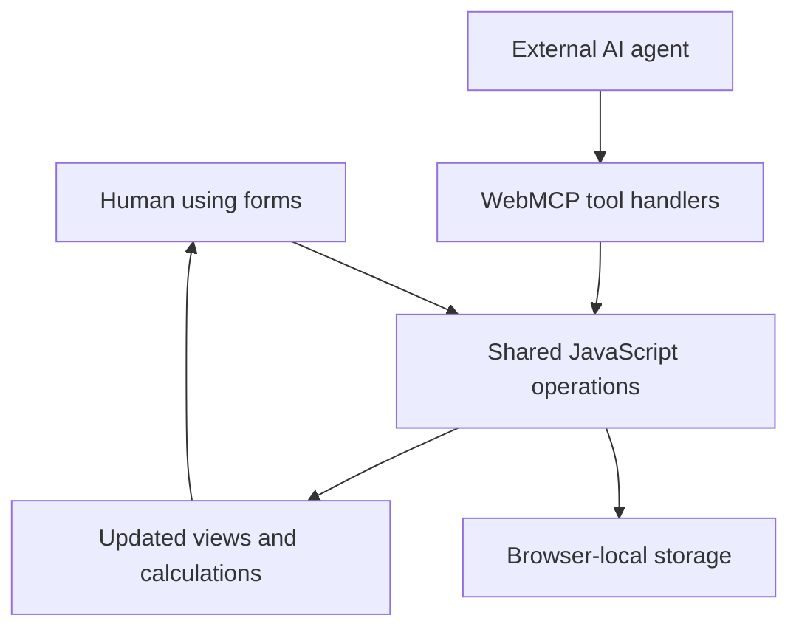

# Meal Planner V2

Meal Planner is a browser-based workspace for recipes, weekly meal plans, pantry inventory and shopping lists. You can use it yourself or let a compatible external AI agent operate it through WebMCP.

The idea is simple: an agent helps decide what to eat, and the website keeps the plan somewhere you can inspect, edit and use. There is no built-in chatbot.

[Open the application](https://meal-planner-lfi2.onrender.com/)

## How you use it

Save recipes, put them into breakfast, lunch or dinner slots, and record the ingredients you already have. The Shopping view calculates what is missing for the selected week.

The six tabs each have a specific job:

| Tab | What it holds |
| --- | --- |
| Plan | Meals by date, with a recipe and serving count for each slot |
| Recipes | Ingredients, quantities, instructions, servings and cooking times |
| Pantry | The quantities of ingredients you already have |
| Shopping | The calculated ingredients to buy, with optional price estimates |
| Sources | Saved articles, videos and references, optionally linked to recipes |
| Profile | Household size, dietary preferences, allergies, budget, equipment and goals |

An external agent can read this information and update it through the page's tools. You still see and control the result through the normal interface.

## Architecture: what runs where

The website runs in your browser. The hosting service delivers HTML, CSS and JavaScript; it does not run the meal-planning logic or store your meal records in a server database.

There are three responsibilities:

| Part | Responsibility |
| --- | --- |
| Human | Sets goals, supplies constraints, reviews the plan and makes changes |
| External agent | Researches recipes or prices, selects meals and coordinates the steps |
| Website | Validates supported inputs, stores records, calculates quantities and displays the result |

WebMCP connects the external agent to JavaScript operations on the page. It is not a model, a recipe generator or a separate backend.



The important architectural choice is that humans and agents use the same underlying operations. Saving a recipe through the form calls `saveRecipe()`. The `save_recipe` tool calls that function too. Planning a meal works the same way through `planMeal()`.

There is no second copy of the meal plan inside an agent backend that must be synchronized with the website.

## What happens when a meal is planned

Suppose a saved recipe uses 200 g of rice for two servings. You schedule it for four people and already have 150 g of rice in the pantry.

1. The person or agent selects the recipe, date, meal slot and serving count.
2. The application checks that the date and slot are valid, the recipe exists and the serving count is positive.
3. It saves a meal record referring to that recipe.
4. The interface redraws. Shopping scales the rice requirement to 400 g, subtracts the 150 g in the pantry and shows 250 g to buy.

The agent does not need to perform this arithmetic. The website calculates it from the saved records every time.

The shopping list is a calculated view, not a separately maintained copy of the plan. Editing a recipe, changing servings or updating pantry quantities changes the result. Calculating a list does not consume or reduce the recorded pantry inventory.

Recipe matching matters: pantry subtraction groups ingredients by normalized name and unit. It ignores case and extra whitespace, but does not treat "rice" and "basmati rice" as synonyms or convert kilograms to grams. Use consistent names and units. Unquantified ingredients remain "as needed"; numeric quantities are rounded to two decimal places.

## How the code is organized

This is a small vanilla JavaScript application, not a framework application with a build pipeline. The files separate the core workflow from supporting features, but share functions and page state.

| File | Responsibility |
| --- | --- |
| [index.html](index.html) | Defines the tabs, forms and dialogs, and loads the scripts |
| [app.js](app.js) | Owns recipes, plans and pantry; handles their forms, calculations, rendering and tools |
| [webmcp-status.js](webmcp-status.js) | Registers tools through a shared helper and reports registration/discovery status |
| [preferences.js](preferences.js) | Stores and edits the planning profile |
| [sources.js](sources.js) | Stores references and renders supported video embeds |
| [shopping-pricing.js](shopping-pricing.js) | Stores price quotes and calculates whole-package shopping estimates |
| [shopping-localization.js](shopping-localization.js) | Adds the explicit shopping-currency tool |
| [import-data.js](import-data.js) | Validates saved core data and handles replacement imports |
| [recipe-view.js](recipe-view.js) | Adds the read-only recipe dialog |
| [styles.css](styles.css), [shell.css](shell.css), [sources.css](sources.css), [recipe-view.css](recipe-view.css) | Style the interface and its supporting views |

Script order is intentional. The registration helper loads first, followed by the core definitions and then the feature scripts. Core data loading and initial rendering wait for `DOMContentLoaded`, by which time the import validator is available.

Supporting features extend the existing page rather than starting separate applications. Pricing wraps the shopping renderer; Sources listens for the `mealstatechange` event so recipe associations can refresh.

This keeps the project small, but it also means script order and shared functions are dependencies to preserve when making changes.

## Where the data lives

Saved data belongs to this site address in the current browser profile. JavaScript keeps working state in memory and saves JSON to `localStorage` so it can be loaded on the next visit.

| Stored record | Contents | Included in Export / Import? |
| --- | --- | --- |
| `meal-planner.webmcp.v1` | Recipes, meal plans, pantry and timestamps | Yes |
| `meal-planner.preferences.v1` | Household constraints, budget, equipment and goals | No |
| `meal-planner.sources.v1` | Videos, articles and recipe references | No |
| `meal-planner.shopping-pricing.v1` | Shopping location, stores, currency and quotes | No |

**Export is a core meal-data backup, not a full-workspace backup.** Import validates that snapshot and replaces the current recipes, plans and pantry; it does not merge them or replace the other records.

Deleting a recipe also removes meals that use it. Sources are kept separately: their links to a deleted recipe, or to a recipe absent from an imported snapshot, may become unresolved without deleting the source itself.

If a save fails, the application preserves its last committed state and reports an error. Unreadable saved records produce a warning rather than being silently overwritten. A valid import can replace unreadable core meal data; Profile has a Clear action. Corrupt Sources or pricing records currently require recovery through browser storage tools.

There is no automatic cross-device or cross-tab synchronization. Use one active tab when demonstrating the app. Changing the site address, changing browser profiles or clearing site data separates or removes access to that saved workspace.

"Local-first" does not mean guaranteed offline loading: the app has no offline service worker. External research, source links and video providers also need network access. Supported YouTube, Vimeo and direct video URLs can render in Sources, subject to provider availability and embedding restrictions.

Local storage also does not mean agent interactions are private to the device. Tools return data to the external agent using them; that agent's service and privacy behavior are separate from this application.

## How WebMCP fits

The implementation registers named tools through `document.modelContext.registerTool()`, using the shared `registerMealTool` helper. Each tool describes its inputs and calls the relevant application function. Results and errors are returned as structured text for the agent to interpret.

There is no separate MCP server to deploy. Agent operation requires a compatible browser/agent environment supporting this interface. The human interface remains usable when WebMCP is unavailable.

A typical agent session is:

1. Read the saved Profile, recipes, plan and pantry.
2. Ask the user for missing constraints.
3. Research and save any needed recipes and supporting Sources.
4. Schedule meals using saved recipe IDs.
5. Ask the website to calculate the shopping requirements.
6. Optionally research prices and save quotes for the website to compare.

The website does not automatically enforce dietary preferences or certify allergy safety. Those fields provide context for planning; people must still review suitability.

The page exposes 25 tools. Their names are listed below as a developer reference, not as instructions you need to memorize to use the app.

<details>
<summary>WebMCP tool reference</summary>

### Context and profile

- `meal_context`
- `get_preferences`
- `set_preferences`

### Recipes and planning

- `list_recipes`
- `get_recipe`
- `save_recipe`
- `delete_recipe`
- `get_meal_plan`
- `plan_meal`
- `plan_meals`
- `remove_meal`

### Pantry and shopping

- `list_pantry`
- `set_pantry_item`
- `build_shopping_list`
- `shopping_price_context`
- `set_shopping_profile`
- `set_shopping_currency`
- `save_price_quotes`
- `priced_shopping_list`
- `clear_price_quotes`

### Data portability

- `export_meal_data`
- `import_meal_data`

### Sources

- `list_sources`
- `save_source`
- `delete_source`

The status indicator counts this page’s discoverable tools when the browser provides `getTools()`. Otherwise it counts successful registrations and identifies that fallback in its tooltip. Failed registrations show a partial count. The expected complete surface is 25 tools, registered once each.

</details>

## Optional prices and promotions

Price research happens outside the website. The agent can use a location explicitly supplied by the user to find offers, then save price quotes through the tools. The site itself does not fetch or verify retailer prices.

Once quotes are saved, the pricing code compares whole-package costs for the selected week, converts supported package units, excludes expired quotes and reports missing coverage. Preferred stores take precedence when matching offers are available.

Shopping currency is explicitly selected; `XXX` means unset. It is separate from the Profile's budget currency. Changing shopping currency clears old quotes instead of relabelling their amounts. Changing location through the human form resets currency and clears quotes.

Promotions are descriptive notes: quotes need an effective single-package price. Estimates do not calculate delivery, tax adjustments or conditional multi-buy deals. Package conversions support compatible mass, volume and count units, with fixed cooking conventions of 240 ml per cup, 15 ml per tablespoon and 5 ml per teaspoon. This pricing conversion is separate from the stricter name/unit matching used for pantry subtraction.

The application does not request device geolocation. External links and embeds contact their providers; the app includes no analytics, hosted model or application API key.

## Run it locally

From the repository directory, with Python installed:

```bash
python -m http.server 8080
```

Open `http://localhost:8080/`. No build step or dependency installation is required for the website.

To try the human workflow, save one recipe, add a pantry ingredient, put the recipe into a meal slot and open Shopping. Change the serving count to see the calculation update.

For an agent demonstration, prepare the compatible browser and agent first and inspect the WebMCP status indicator. The Agent prompt button copies a starter request:

> Use this page's WebMCP tools to read my saved Profile and meal context. Plan four dinners that fit those preferences, use my pantry, save any missing recipes and supporting Sources, then build my shopping list. Ask me for missing constraints.

## Tests and deployment

Run the regression suite with Node.js:

```bash
node --test tests/*.test.cjs
```

CI checks JavaScript syntax, referenced files and key application surfaces, then runs the dependency-free regression suite. The tests load the actual scripts in HTML order using a minimal DOM/WebMCP adapter. They cover tool registration, state changes, failed saves, malformed storage, imports and pricing calculations.

These tests are not a substitute for real-browser checks of layout, downloads, clipboard access, video playback or native WebMCP interoperability.

Deployment only needs a static host serving the repository root over HTTPS. Configuration is included for Render in [render.yaml](render.yaml) and Netlify in [netlify.toml](netlify.toml).

## Project history

This is the AI Builders 2026 competition version, created from the earlier `noob-express3000/meal_planner` project on 2026-09-08. The original repository remains separate; V2 development continues here.

## License

[MIT](LICENSE)
